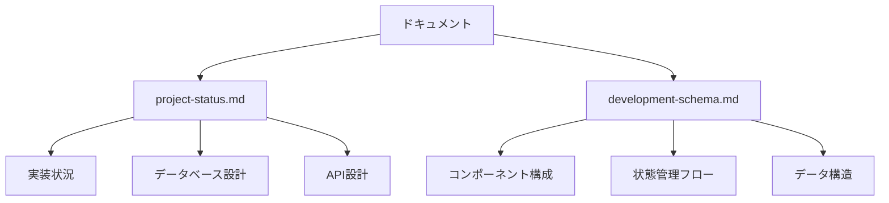

# Legal API プロジェクトドキュメント

このディレクトリには、Legal APIプロジェクトの全ドキュメントが含まれています。

## ディレクトリ構造

```
docs/
├── README.md                    # このファイル
├── architecture/               # アーキテクチャ設計
│   ├── database-schema.md      # データベース設計
│   ├── development-schema.md   # 開発スキーマ
│   └── directory-structure.md  # プロジェクト構造
├── deployment/                # デプロイメント関連
│   ├── README.md              # デプロイメント概要
│   └── testing-deployment.md  # テストとデプロイ手順
├── infrastructure/           # インフラストラクチャ
│   ├── cloudflare-setup.md   # Cloudflare設定
│   └── deployment.md         # デプロイ手順
├── maintenance/              # 運用・保守
│   ├── README.md             # 保守概要
│   └── maintenance.md        # メンテナンス手順
├── development/             # 開発ガイド
│   ├── README.md             # 開発概要
│   └── requirement.md        # 要件定義
├── api/                     # API仕様
│   ├── README.md             # API概要
│   └── api-spec.md          # API仕様書
└── testing/                # テスト関連
    └── README.md             # テスト概要
```

## ドキュメント分類

### 1. アーキテクチャ設計 `/architecture`
- データベース設計図
- システム構成図
- ディレクトリ構造
- 開発スキーマ

### 2. デプロイメント `/deployment`
- デプロイメントフロー
- 環境設定
- テスト手順
- リリース手順

### 3. インフラストラクチャ `/infrastructure`
- Cloudflare設定
- デプロイ手順
- インフラ構成図
- セキュリティ設定

### 4. 運用・保守 `/maintenance`
- 定期メンテナンス手順
- モニタリング設定
- バックアップ/リストア手順
- トラブルシューティング

### 5. 開発ガイド `/development`
- 開発環境セットアップ
- コーディング規約
- Git運用ルール
- レビュープロセス

### 6. API仕様 `/api`
- エンドポイント一覧
- リクエスト/レスポンス仕様
- 認証/認可
- エラーハンドリング

### 7. テスト `/testing`
- テスト戦略
- テストケース
- 自動テスト
- 負荷テスト

## 更新履歴

| 日付 | バージョン | 更新内容 | 更新者 |
|------|------------|----------|---------|
| 2024-02-21 | 1.0.0 | 初期構成作成 | システム管理者 |

## ドキュメント管理ルール

1. **更新頻度**
   - アーキテクチャ文書：変更の都度
   - API仕様：変更の都度
   - 運用手順：四半期ごと
   - その他：必要に応じて

2. **レビュープロセス**
   - 技術文書：開発チームレビュー
   - 運用手順：運用チームレビュー
   - セキュリティ関連：セキュリティ担当レビュー

3. **バージョン管理**
   - メジャーバージョン：大規模な変更
   - マイナーバージョン：機能追加
   - パッチバージョン：バグ修正や軽微な更新

4. **命名規則**
   - ファイル名：ケバブケース（例：`api-spec.md`）
   - ディレクトリ名：小文字のみ
   - 画像ファイル：`YYYYMMDD_説明.拡張子`

## 参考リンク

- [プロジェクトリポジトリ](https://github.com/your-org/legal-api)
- [開発環境セットアップガイド](./development/README.md)
- [API仕様書](./api/api-spec.md)
- [デプロイメントガイド](./deployment/README.md)

## ドキュメント一覧

- [プロジェクト状況](development/project-status.md)
- [開発スキーマ](development/development-schema.md)

## マーメイド図の表示方法

このプロジェクトのドキュメントには、[Mermaid](https://mermaid.js.org/)を使用した図表が含まれています。
以下の方法で表示できます：

### 1. VSCode での表示

1. VSCode に [Markdown Preview Mermaid Support](https://marketplace.visualstudio.com/items?itemName=bierner.markdown-mermaid) 拡張機能をインストール
2. マークダウンファイルをプレビュー表示（`Cmd + Shift + V`）

### 2. GitHub での表示

GitHubは標準でMermaid図をサポートしているため、リポジトリにプッシュすると自動的に表示されます。

### 3. ブラウザでの表示

以下のツールを使用して表示できます：

1. [Mermaid Live Editor](https://mermaid.live/)
   - ドキュメント内の`mermaid`コードブロックの内容をコピー
   - エディタに貼り付けて表示

2. [GitHub Pages](https://pages.github.com/)
   - このリポジトリをGitHub Pagesとして公開
   - 自動的にマーメイド図が表示される

## マーメイド図の例

以下は、マーメイド図の例です：



## 更新方法

1. 対応するマークダウンファイルを編集
2. 変更をコミット
3. GitHub にプッシュ
4. GitHub Pages が自動的に更新（設定されている場合）

## 注意事項

- マーメイド図の構文は[公式ドキュメント](https://mermaid.js.org/syntax/flowchart.html)を参照
- 複雑な図は見やすさのために適切に分割
- 日本語を使用する場合は、正しくエンコードされていることを確認
