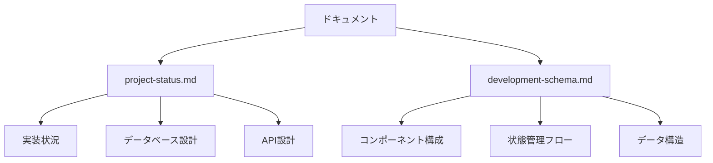

# Legal API ドキュメント

このディレクトリには、Legal APIプロジェクトの設計ドキュメントが含まれています。

## ドキュメント一覧

- [プロジェクト状況](./project-status.md)
- [開発スキーマ](./development-schema.md)

## マーメイド図の表示方法

このプロジェクトのドキュメントには、[Mermaid](https://mermaid.js.org/)を使用した図表が含まれています。
以下の方法で表示できます：

### 1. VSCode での表示

1. VSCode に [Markdown Preview Mermaid Support](https://marketplace.visualstudio.com/items?itemName=bierner.markdown-mermaid) 拡張機能をインストール
2. マークダウンファイルをプレビュー表示（`Cmd + Shift + V`）

### 2. GitHub での表示

GitHubは標準でMermaid図をサポートしているため、リポジトリにプッシュすると自動的に表示されます。

### 3. ブラウザでの表示

以下のツールを使用して表示できます：

1. [Mermaid Live Editor](https://mermaid.live/)
   - ドキュメント内の`mermaid`コードブロックの内容をコピー
   - エディタに貼り付けて表示

2. [GitHub Pages](https://pages.github.com/)
   - このリポジトリをGitHub Pagesとして公開
   - 自動的にマーメイド図が表示される

## マーメイド図の例

以下は、マーメイド図の例です：

## 更新方法

1. 対応するマークダウンファイルを編集
2. 変更をコミット
3. GitHub にプッシュ
4. GitHub Pages が自動的に更新（設定されている場合）

## 注意事項

- マーメイド図の構文は[公式ドキュメント](https://mermaid.js.org/syntax/flowchart.html)を参照
- 複雑な図は見やすさのために適切に分割
- 日本語を使用する場合は、正しくエンコードされていることを確認
