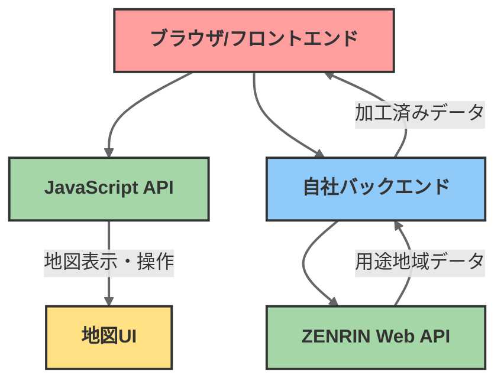

# ZENRIN API アーキテクチャ設計

## 1. JavaScript API（フロントエンド向け）

```javascript
// ZENRINのJavaScript APIはフロントエンドで使用
// 地図の表示や操作に関する機能を提供
const map = new ZMap.Map({
  container: 'map',
  center: [139.767125, 35.681236],
  zoom: 13
});
```

主な機能：
- 地図の表示・操作
- マーカーの配置
- ズーム・パン操作
- インタラクティブな機能
- ユーザー体験（UX）に直結する部分

## 2. Web API（バックエンド向け）

```javascript
// ZENRINのWeb APIはバックエンドで使用
// データ取得やWMS（地図タイル）へのアクセスを管理
const response = await axios.get(`${ZENRIN_WMS_URL}`, {
  params: wmsParams,
  headers: {
    'x-api-key': ZENRIN_API_KEY,
    'Authorization': 'referer'
  }
});
```

主な機能：
- 用途地域情報の取得（WMS）
- APIキーの管理
- データの加工・変換
- エラーハンドリング
- セキュリティ対策

## アーキテクチャ図解



## 分離のメリット

このように分離することで：

1. フロントエンドは見た目と操作性に集中
2. バックエンドはデータ処理とセキュリティに集中
3. それぞれのAPIの特性を活かした実装が可能

になり、結果としてより安定した実装が実現できました！ 