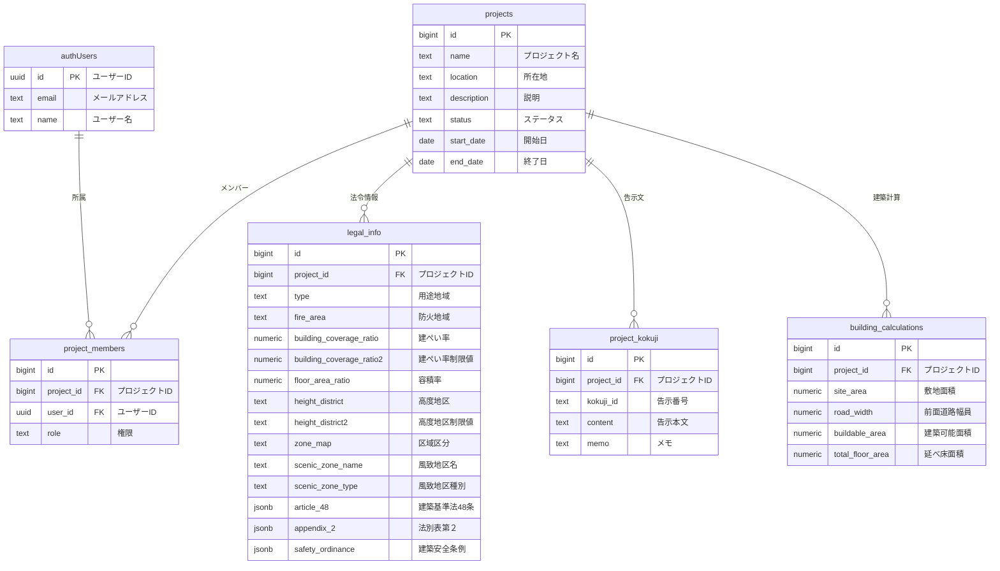

# データベース構造説明

## 1. テーブル関連図



## 2. テーブルの説明

### プロジェクト (projects)
- プロジェクトの基本情報を管理する中心的なテーブル
- 各プロジェクトには複数のメンバー、法令情報、建築計算結果が紐づく
- ステータスは `planning`（計画中）、`in_progress`（進行中）、`completed`（完了）

### プロジェクトメンバー (project_members)
- プロジェクトとユーザーの関連を管理
- 権限レベル：
  - `owner`: プロジェクトオーナー（全ての操作が可能）
  - `admin`: 管理者（メンバー管理や重要な更新が可能）
  - `member`: 一般メンバー（基本的な操作のみ可能）

### 法令情報 (legal_info)
- プロジェクトの用途地域や建築規制に関する情報を保存
- 基本情報：
  - 用途地域、防火地域、建ぺい率、容積率
  - 高度地区と制限値
  - 区域区分（市街化区域、市街化調整区域など）
  - 風致地区名と種別
- 法令制限：
  - 建築基準法48条（用途制限）：
    ```json
    {
      "allowed_uses": ["事務所", "店舗", "共同住宅"],
      "restrictions": {
        "type": "第一種住居地域",
        "details": ["3000㎡以内の店舗", "事務所", "共同住宅"]
      }
    }
    ```
  - 法別表第２（用途地域内の建築物の制限）：
    ```json
    {
      "category": "第二種",
      "restrictions": {
        "height": "20m以下",
        "noise": "50dB以下",
        "other": ["日影規制あり", "開口部規制あり"]
      }
    }
    ```
  - 東京都建築安全条例：
    ```json
    {
      "articles": ["第30条", "第31条"],
      "restrictions": {
        "evacuation": ["2方向避難路の確保", "非常用照明の設置"],
        "structure": ["耐火建築物", "準耐火建築物"]
      }
    }
    ```

### プロジェクト告示文 (project_kokuji)
- プロジェクトに関連する告示文を保存
- 告示番号と本文を保持
- メモ機能で告示文の適用理由などを記録可能
- APIから取得した告示情報を直接保存可能な構造

### 建築計算 (building_calculations)
- プロジェクトの建築計算結果を保存
- 敷地面積や前面道路幅員などの入力値
- 建築可能面積や延べ床面積などの計算結果
- 履歴として保存され、複数の計算結果を比較可能

## 3. 主要な関連の説明

1. プロジェクトとメンバー
   - 1つのプロジェクトには複数のメンバーが所属可能
   - メンバーは異なる権限レベルを持つ
   - メンバーはプロジェクトの削除と共に自動的に削除（cascade）

2. プロジェクトと法令情報
   - 各プロジェクトに1つの法令情報が紐づく
   - 法令情報はプロジェクトの削除と共に自動的に削除

3. プロジェクトと告示文
   - プロジェクトには複数の告示文を保存可能
   - 告示文はプロジェクトごとに独立して保存
   - APIから取得した告示情報を直接保存

4. プロジェクトと建築計算
   - 1つのプロジェクトに対して複数の建築計算結果を保存可能
   - 計算結果はプロジェクトの削除と共に自動的に削除

## 4. セキュリティ設定

すべてのテーブルにRow Level Security (RLS)が設定されており：

1. プロジェクトメンバーのみが自身が所属するプロジェクトの情報にアクセス可能
2. 権限レベルに応じて実行可能な操作が制限される
3. 告示文（kokuji）のみ、全ユーザーが閲覧可能

## 5. 共通フィールド

すべてのテーブルに以下の共通フィールドが存在：

- `created_at`: レコード作成日時
- `updated_at`: 最終更新日時（トリガーで自動更新）
- `created_by`: 作成者のユーザーID（任意）
- `updated_by`: 最終更新者のユーザーID（任意） 