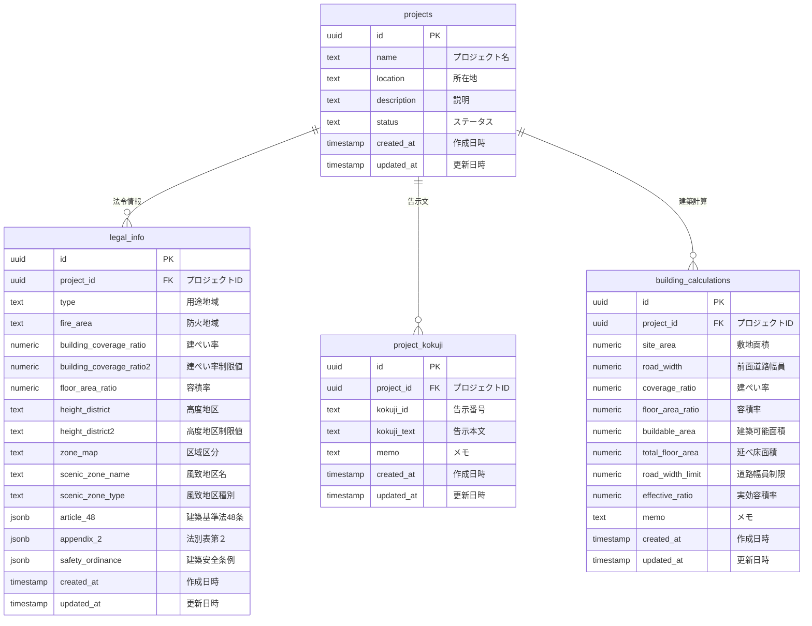

# データベース構造説明

## 1. テーブル関連図

## 2. テーブルの説明

### プロジェクト (projects)
- プロジェクトの基本情報を管理する中心的なテーブル
- 各プロジェクトには法令情報、建築計算結果が紐づく
- ステータスは `planning`（計画中）、`in_progress`（進行中）、`completed`（完了）、`on_hold`（保留中）

### 法令情報 (legal_info)
- プロジェクトの用途地域や建築規制に関する情報を保存
- 基本情報：
  - 用途地域、防火地域、建ぺい率、容積率
  - 高度地区と制限値
  - 区域区分（市街化区域、市街化調整区域など）
  - 風致地区名と種別
- 法令制限：
  - 建築基準法48条（用途制限）
  - 法別表第２（用途地域内の建築物の制限）
  - 東京都建築安全条例

### プロジェクト告示文 (project_kokuji)
- プロジェクトに関連する告示文を保存
- 告示番号と本文を保持
- メモ機能で告示文の適用理由などを記録可能

### 建築計算 (building_calculations)
- プロジェクトの建築計算結果を保存
- 入力値：
  - 敷地面積（site_area）
  - 前面道路幅員（road_width）
  - 建ぺい率（coverage_ratio）
  - 容積率（floor_area_ratio）
- 計算結果：
  - 建築可能面積（buildable_area）
  - 延べ床面積（total_floor_area）
  - 道路幅員による制限（road_width_limit）
  - 実効容積率（effective_ratio）

## 3. 主要な変更点

1. 認証機能の削除による変更：
   - `authUsers`テーブルを削除
   - `project_members`テーブルを削除
   - 各テーブルから`created_by`と`updated_by`カラムを削除

2. IDの型の変更：
   - すべてのIDを`uuid`型に統一
   - Supabaseの自動生成UUID機能を活用

3. シンプル化：
   - プロジェクトの開始日・終了日を削除（必要に応じて後で追加可能）
   - セキュリティ設定（RLS）を削除

## 4. 共通フィールド

すべてのテーブルに以下の共通フィールドが存在：

- `created_at`: レコード作成日時（デフォルト: `now()`）
- `updated_at`: 最終更新日時（トリガーで自動更新） 