# 開発中機能のスキーマ設計

## 1. プロジェクト管理機能の拡張

### 1.1 プロジェクトステータス管理

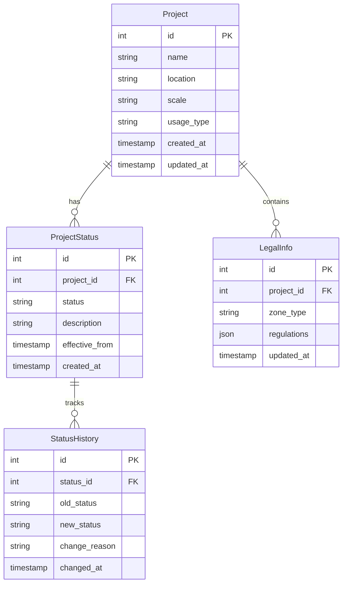

### 1.2 検索・フィルタリング機能

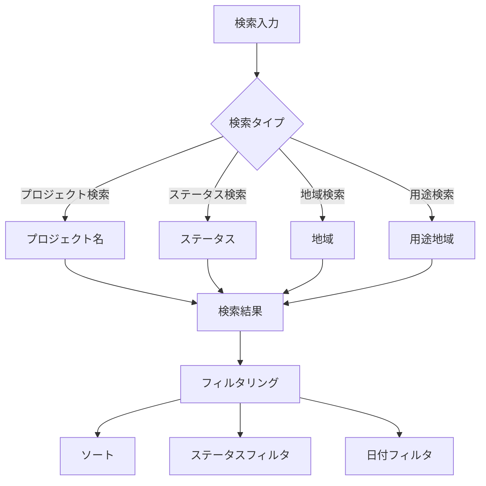

## 2. 法令アップデート通知機能

### 2.1 データベース構造

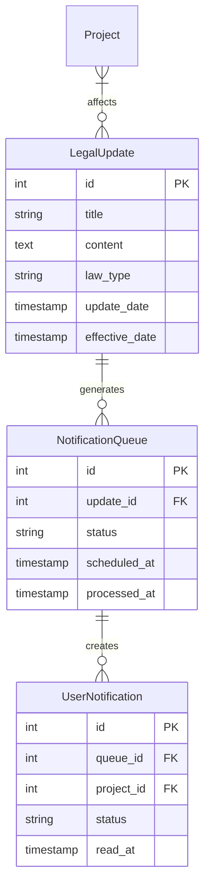

### 2.2 通知フロー

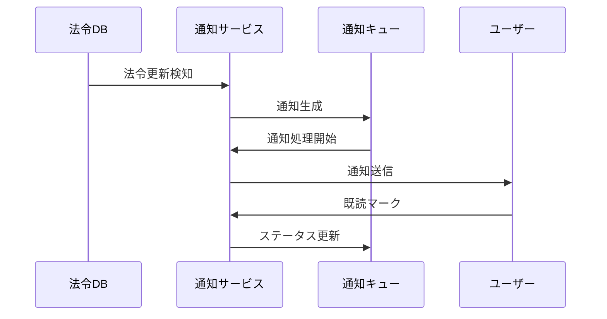

## 3. 法令チェックリスト機能

### 3.1 データモデル

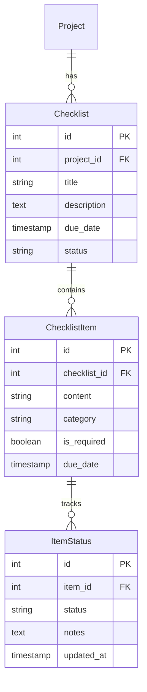

### 3.2 ステータス管理フロー

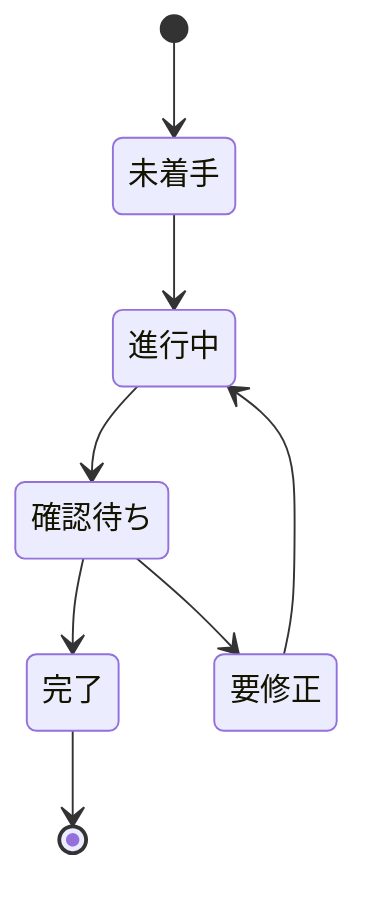

## 4. API設計

### 4.1 プロジェクト管理API

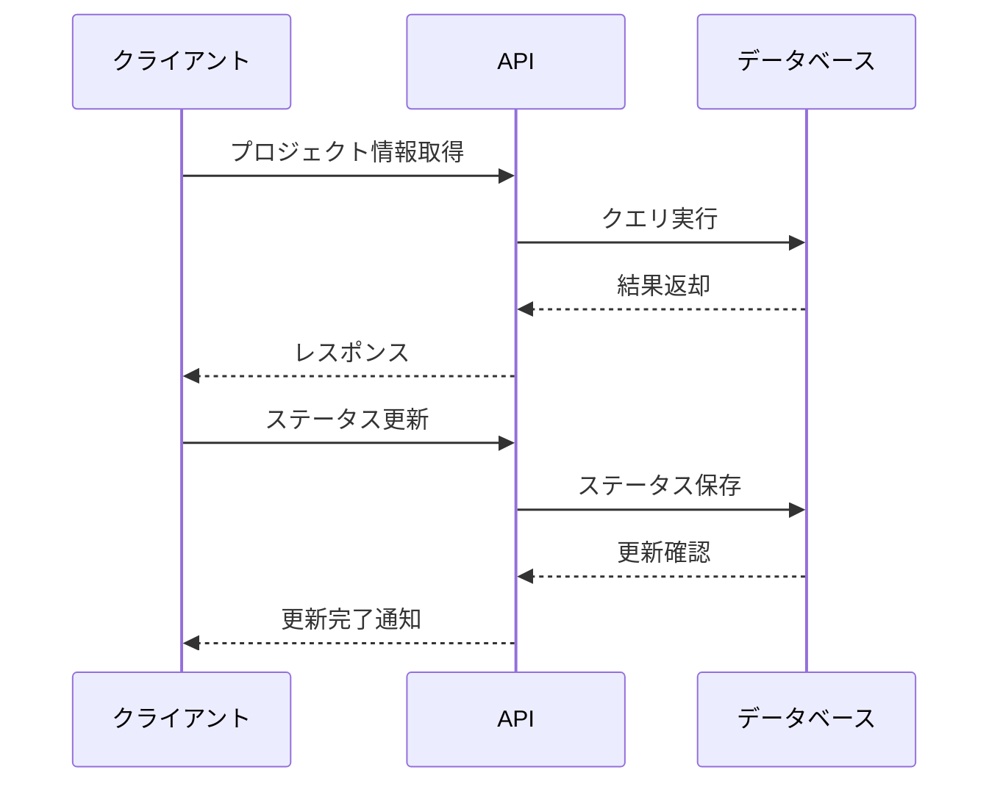

### 4.2 通知API

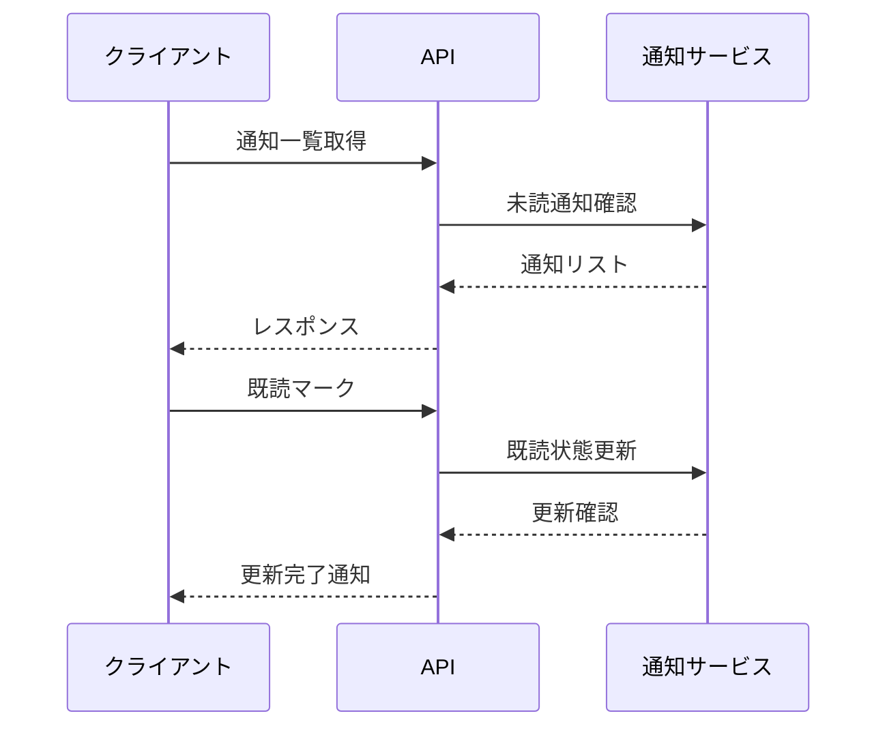

## 5. 法令情報保存機能

### 5.1 データベース構造

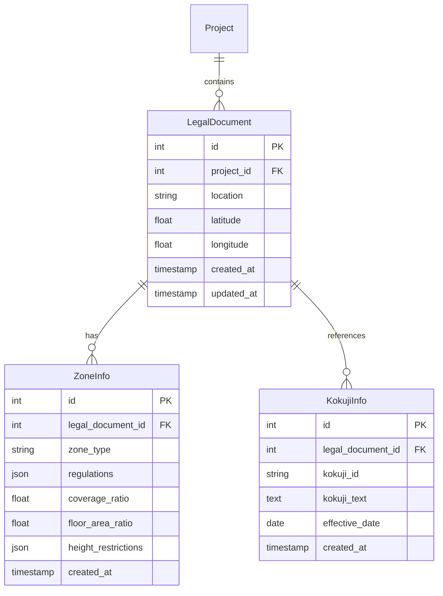

### 5.2 API設計

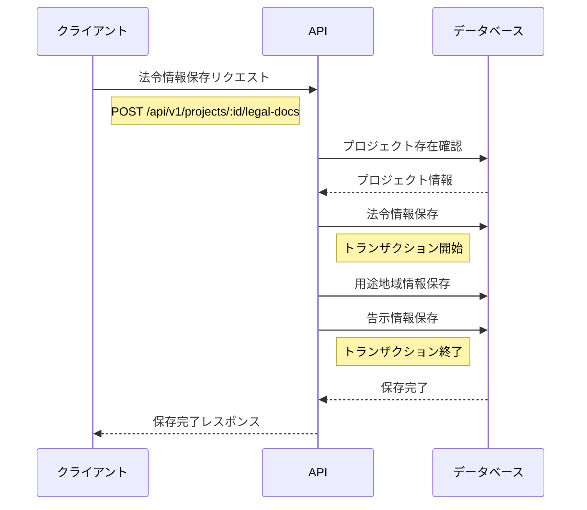

### 5.3 保存データ構造

```json
{
  "location": "東京都千代田区丸の内1-1-1",
  "coordinates": {
    "latitude": 35.681236,
    "longitude": 139.767125
  },
  "zoneInfo": {
    "zone_type": "商業地域",
    "regulations": {
      "coverage_ratio": 80,
      "floor_area_ratio": 400,
      "height_restrictions": {
        "absolute_max": 60,
        "gradient_restrictions": []
      }
    }
  },
  "kokujiInfo": {
    "kokuji_id": "412K500040001453",
    "kokuji_text": "...",
    "effective_date": "2024-01-01"
  }
}

```

## 6. プロジェクト詳細画面

### 6.1 実装済みコンポーネント構成

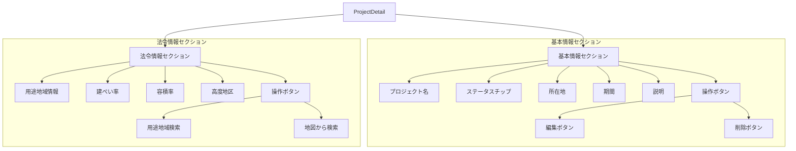

### 6.2 追加予定のコンポーネント

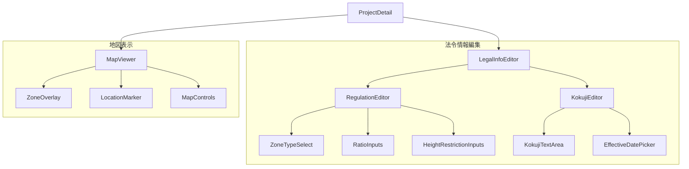

### 6.3 状態管理フロー

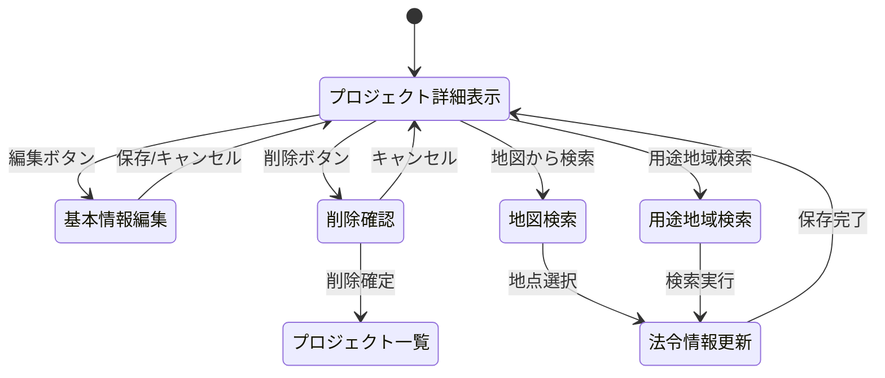

### 6.4 データ構造

```json
{
  "project": {
    "id": 1,
    "name": "丸の内プロジェクト",
    "location": "東京都千代田区丸の内",
    "start_date": "2024-04-01",
    "end_date": "2025-03-31",
    "description": "丸の内エリアの再開発プロジェクト",
    "status": "planning"
  },
  "legalInfo": {
    "zoneType": "商業地域",
    "coverageRatio": 80,
    "floorAreaRatio": 400,
    "heightDistrict": "第三種高度地区",
    "kokuji": {
      "id": "412K500040001453",
      "text": "...",
      "effectiveDate": "2024-01-01"
    }
  }
}

```

## 7. 建築計算機能

### 7.1 計算ロジック

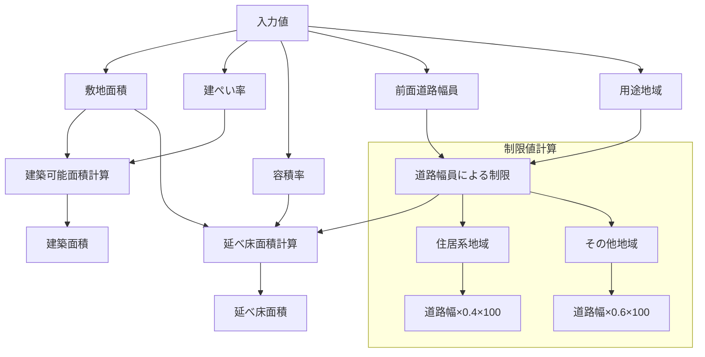

### 7.2 計算式

```javascript
// 建築可能面積の計算
const calculateBuildableArea = (siteArea, coverageRatio) => {
  return (siteArea * coverageRatio) / 100;
};

// 延べ床面積の計算（道路幅員制限考慮）
const calculateTotalFloorArea = (siteArea, floorAreaRatio, roadWidth, zoneType) => {
  // 道路幅員による制限
  const roadWidthLimit = zoneType.includes('住居') 
    ? roadWidth * 0.4 * 100
    : roadWidth * 0.6 * 100;

  // 制限値と指定容積率の小さい方を採用
  const effectiveRatio = Math.min(floorAreaRatio, roadWidthLimit);
  return (siteArea * effectiveRatio) / 100;
};
```

### 7.3 データ構造の更新

```json
{
  "project": {
    "id": 1,
    "name": "丸の内プロジェクト",
    "location": "東京都千代田区丸の内",
    "start_date": "2024-04-01",
    "end_date": "2025-03-31",
    "description": "丸の内エリアの再開発プロジェクト",
    "status": "planning"
  },
  "legalInfo": {
    "zoneType": "商業地域",
    "coverageRatio": 80,
    "floorAreaRatio": 400,
    "heightDistrict": "第三種高度地区",
    "roadWidth": 25,
    "siteArea": 1000,
    "calculations": {
      "buildableArea": 800,
      "totalFloorArea": 4000,
      "roadWidthLimit": 1500,
      "effectiveFloorAreaRatio": 400
    },
    "kokuji": {
      "id": "412K500040001453",
      "text": "...",
      "effectiveDate": "2024-01-01"
    }
  }
}
```

### 7.4 ZoneSearch機能の統合

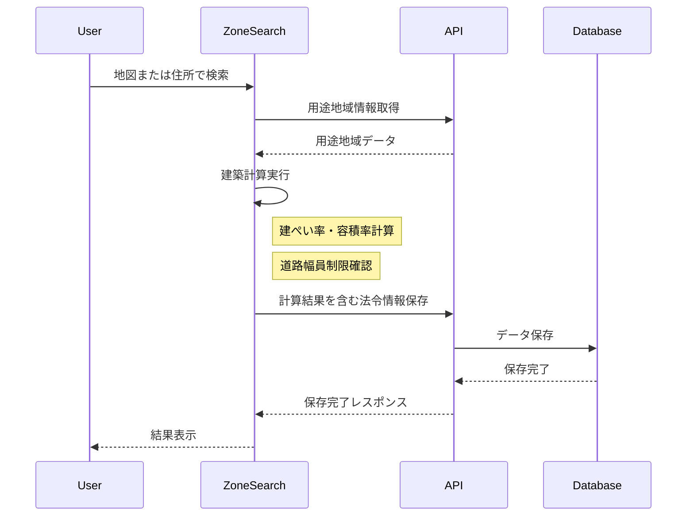

### 7.5 入力フォームの更新

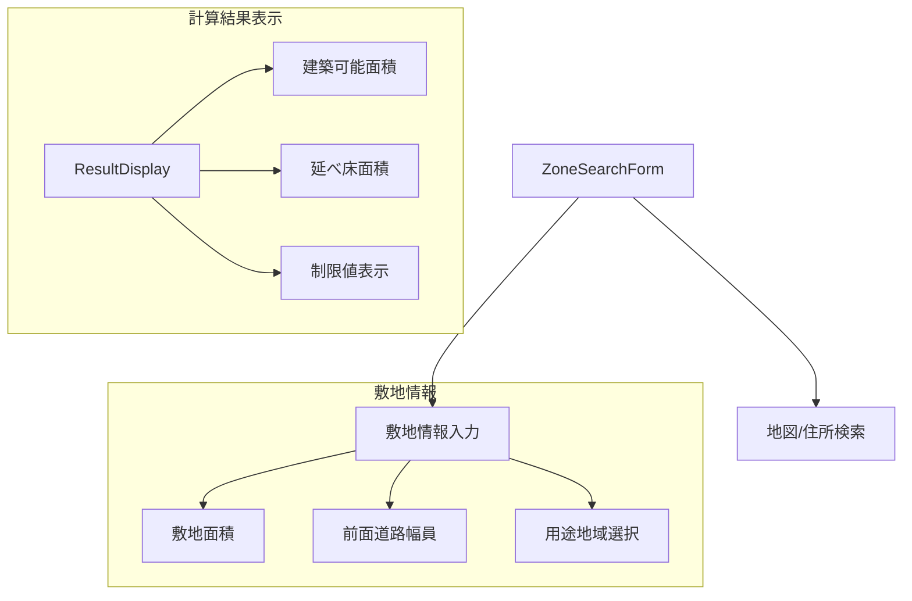
