# 開発中機能のスキーマ設計

## 1. プロジェクト管理機能の拡張

### 1.1 プロジェクトステータス管理

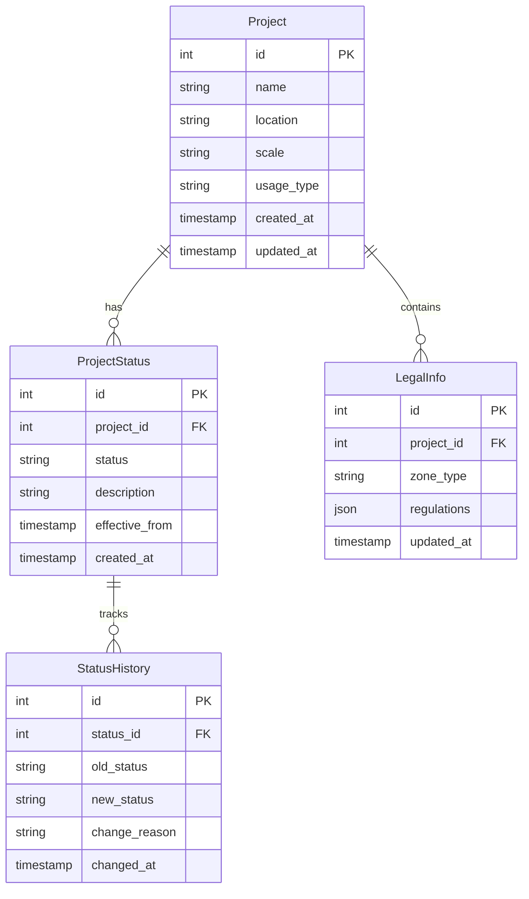

### 1.2 検索・フィルタリング機能

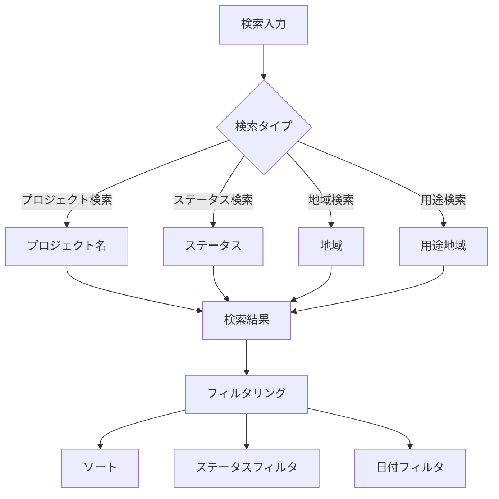

## 2. 法令アップデート通知機能

### 2.1 データベース構造

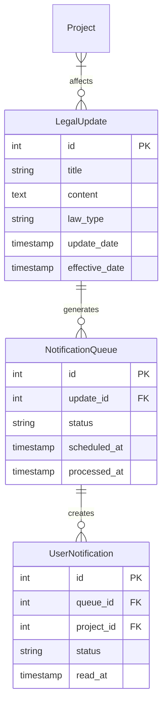

### 2.2 通知フロー

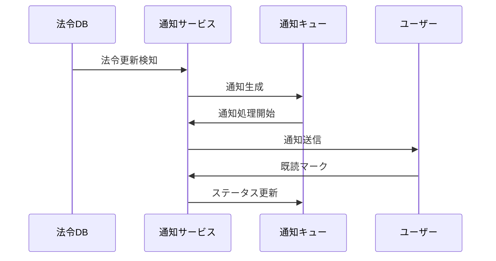

## 3. 法令チェックリスト機能

### 3.1 データモデル

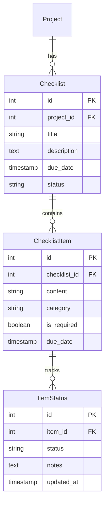

### 3.2 ステータス管理フロー

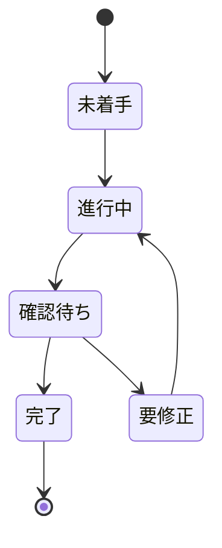

## 4. API設計

### 4.1 プロジェクト管理API

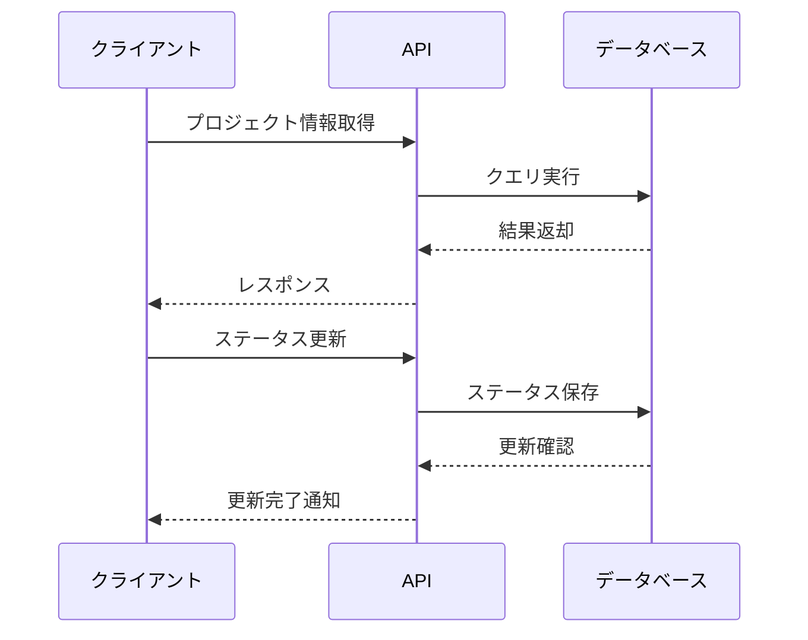

### 4.2 通知API

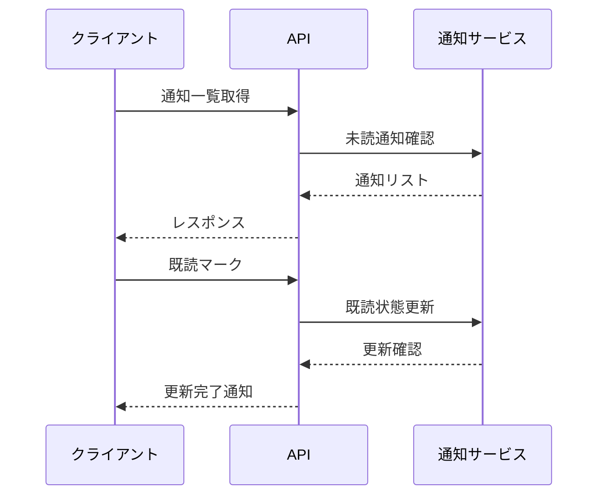

## 5. 法令情報保存機能

### 5.1 データベース構造

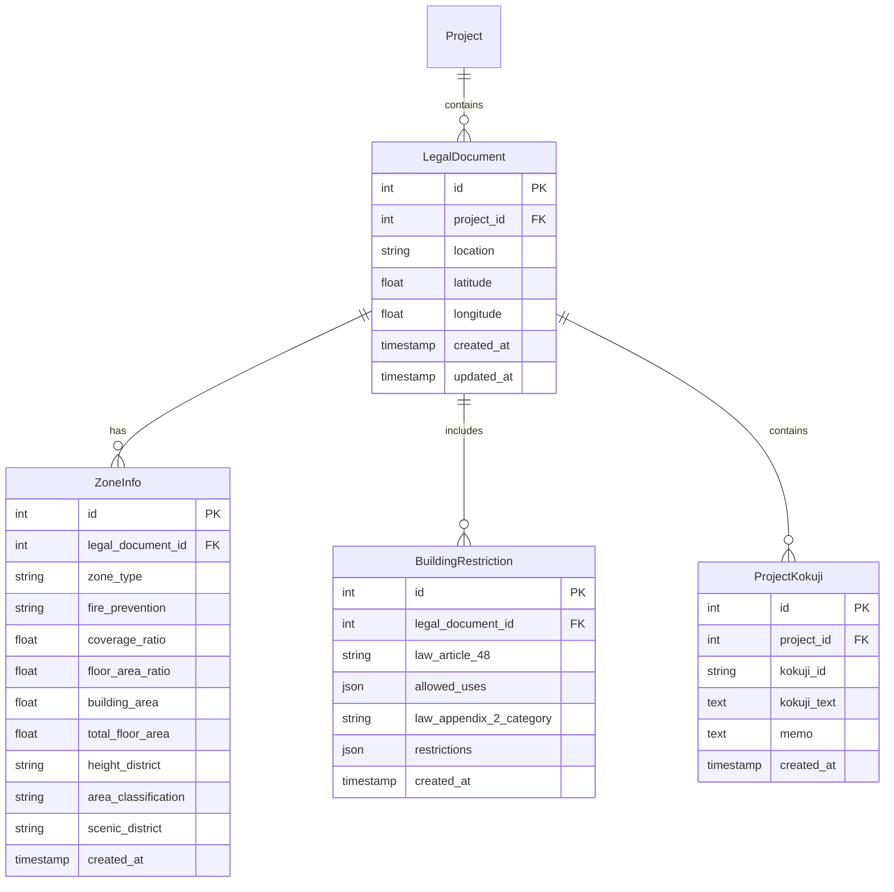

### 5.2 データベース定義

```sql
-- 法令文書
CREATE TABLE legal_documents (
    id SERIAL PRIMARY KEY,
    project_id INTEGER REFERENCES projects(id),
    location TEXT NOT NULL,
    latitude FLOAT NOT NULL,
    longitude FLOAT NOT NULL,
    created_at TIMESTAMP DEFAULT CURRENT_TIMESTAMP,
    updated_at TIMESTAMP DEFAULT CURRENT_TIMESTAMP
);

-- 用途地域情報
CREATE TABLE zone_info (
    id SERIAL PRIMARY KEY,
    legal_document_id INTEGER REFERENCES legal_documents(id),
    zone_type VARCHAR(100) NOT NULL,
    fire_prevention VARCHAR(100) NOT NULL,
    coverage_ratio FLOAT,
    floor_area_ratio FLOAT,
    building_area FLOAT,
    total_floor_area FLOAT,
    height_district VARCHAR(100),
    area_classification VARCHAR(100),
    scenic_district VARCHAR(100),
    created_at TIMESTAMP DEFAULT CURRENT_TIMESTAMP
);

-- 建築制限情報
CREATE TABLE building_restrictions (
    id SERIAL PRIMARY KEY,
    legal_document_id INTEGER REFERENCES legal_documents(id),
    law_article_48 VARCHAR(100),
    allowed_uses JSONB,
    law_appendix_2_category VARCHAR(100),
    restrictions JSONB,
    created_at TIMESTAMP DEFAULT CURRENT_TIMESTAMP
);

-- プロジェクト告示文
CREATE TABLE project_kokuji (
    id SERIAL PRIMARY KEY,
    project_id INTEGER REFERENCES projects(id),
    kokuji_id VARCHAR(100) NOT NULL,
    kokuji_text TEXT NOT NULL,
    memo TEXT,
    created_at TIMESTAMP DEFAULT CURRENT_TIMESTAMP,
    updated_at TIMESTAMP DEFAULT CURRENT_TIMESTAMP
);
```

### 5.3 API設計

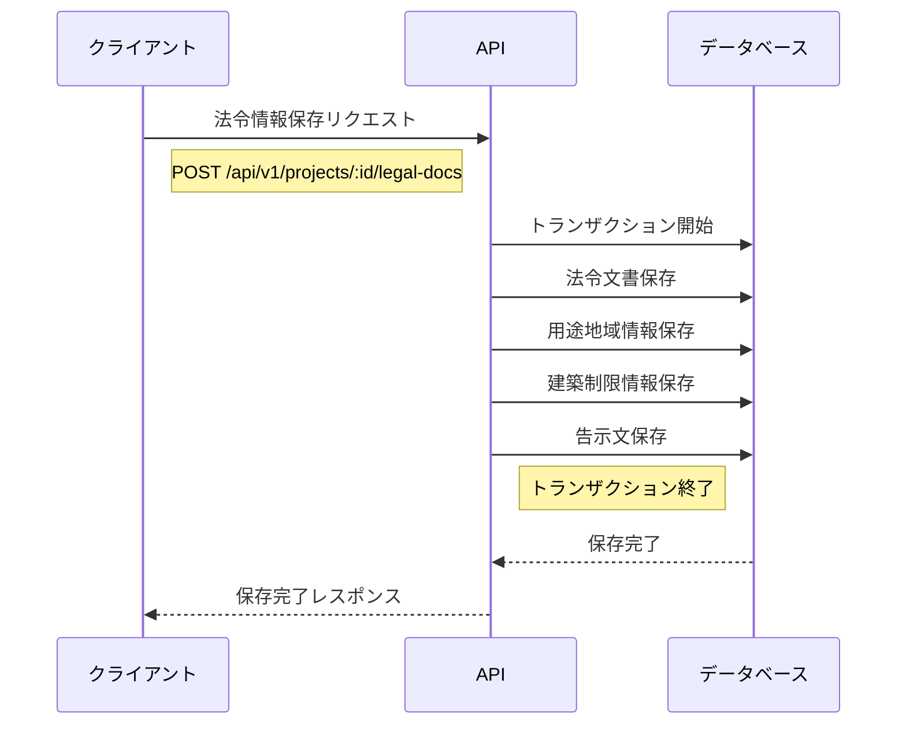

### 5.4 保存データ例

```json
{
  "location": {
    "address": "東京都千代田区丸の内1-1-1",
    "coordinates": {
      "latitude": 35.681236,
      "longitude": 139.767125
    }
  },
  "zoning_info": {
    "zone_type": "商業地域",
    "fire_prevention": "防火地域",
    "coverage_ratio": 80,
    "floor_area_ratio": 400,
    "building_area": 800,
    "total_floor_area": 3200,
    "height_district": "第三種高度地区",
    "area_classification": "市街化区域",
    "scenic_district": null
  },
  "building_restrictions": {
    "building_standard_law_48": {
      "allowed_uses": ["事務所", "店舗", "共同住宅"],
      "restrictions": []
    },
    "law_appendix_2": {
      "category": "第二種",
      "restrictions": []
    }
  },
  "kokuji": {
    "kokuji_id": "412K500040001453",
    "kokuji_text": "...",
    "memo": "..."
  }
}
```

## 6. プロジェクト詳細画面

### 6.1 コンポーネント構成
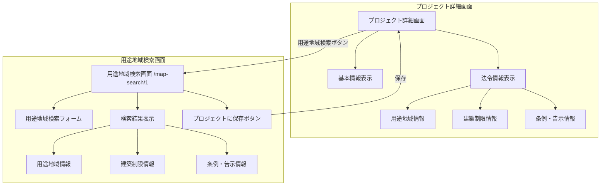

### 6.2 画面遷移フロー

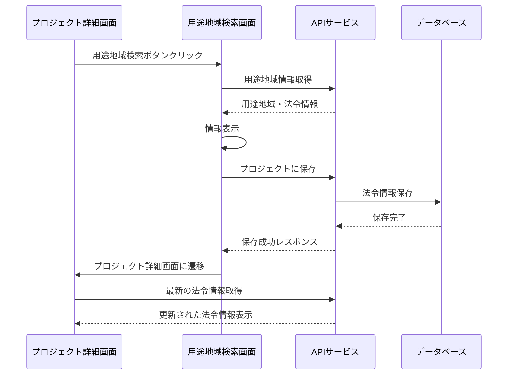

### 6.3 データベース構造

```sql
-- プロジェクト
CREATE TABLE projects (
    id SERIAL PRIMARY KEY,
    name VARCHAR(255) NOT NULL,
    location TEXT,
    description TEXT,
    created_at TIMESTAMP DEFAULT CURRENT_TIMESTAMP,
    updated_at TIMESTAMP DEFAULT CURRENT_TIMESTAMP
);

-- 法令情報
CREATE TABLE legal_info (
    id SERIAL PRIMARY KEY,
    project_id INTEGER REFERENCES projects(id),
    zone_type VARCHAR(100) NOT NULL,
    fire_prevention VARCHAR(100),
    coverage_ratio INTEGER,
    floor_area_ratio INTEGER,
    height_district VARCHAR(100),
    area_classification VARCHAR(100),
    created_at TIMESTAMP DEFAULT CURRENT_TIMESTAMP,
    updated_at TIMESTAMP DEFAULT CURRENT_TIMESTAMP
);

-- 建築制限情報
CREATE TABLE building_restrictions (
    id SERIAL PRIMARY KEY,
    legal_info_id INTEGER REFERENCES legal_info(id),
    restriction_type VARCHAR(100),
    allowed_uses JSONB,
    restrictions JSONB,
    created_at TIMESTAMP DEFAULT CURRENT_TIMESTAMP
);

-- 条例・告示情報
CREATE TABLE regulations (
    id SERIAL PRIMARY KEY,
    legal_info_id INTEGER REFERENCES legal_info(id),
    regulation_type VARCHAR(100),
    content TEXT,
    effective_date DATE,
    created_at TIMESTAMP DEFAULT CURRENT_TIMESTAMP
);
```

### 6.4 API エンドポイント

```markdown
# API Endpoints

## プロジェクト関連
GET    /api/v1/projects/:id              # プロジェクト詳細取得
PUT    /api/v1/projects/:id              # プロジェクト更新

## 法令情報関連
GET    /api/v1/projects/:id/legal-info   # プロジェクトの法令情報取得
POST   /api/v1/projects/:id/legal-info   # 法令情報保存
PUT    /api/v1/legal-info/:id            # 法令情報更新

## 用途地域検索
GET    /api/v1/zone-search               # 用途地域情報検索
```

## 7. 建築計算機能

### 7.1 計算ロジック

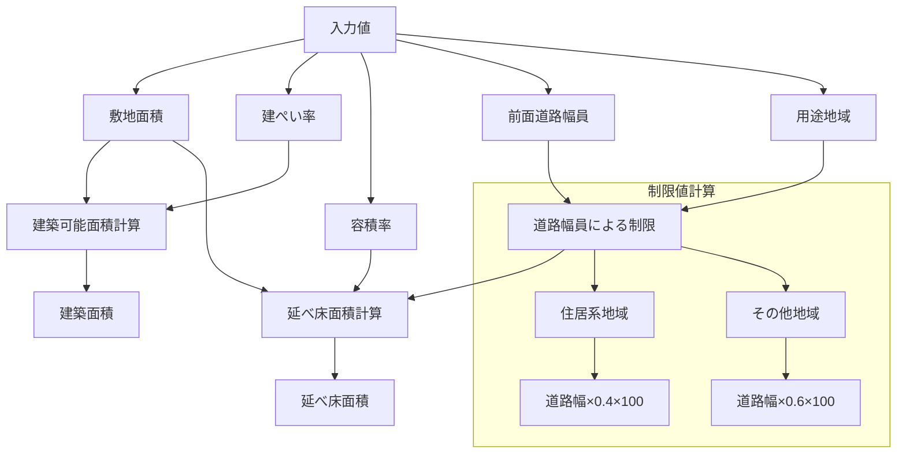

### 7.2 計算式

```javascript
// 建築可能面積の計算
const calculateBuildableArea = (siteArea, coverageRatio) => {
  return (siteArea * coverageRatio) / 100;
};

// 延べ床面積の計算（道路幅員制限考慮）
const calculateTotalFloorArea = (siteArea, floorAreaRatio, roadWidth, zoneType) => {
  // 道路幅員による制限
  const roadWidthLimit = zoneType.includes('住居') 
    ? roadWidth * 0.4 * 100
    : roadWidth * 0.6 * 100;

  // 制限値と指定容積率の小さい方を採用
  const effectiveRatio = Math.min(floorAreaRatio, roadWidthLimit);
  return (siteArea * effectiveRatio) / 100;
};
```

### 7.3 データ構造の更新

```json
{
  "project": {
    "id": 1,
    "name": "丸の内プロジェクト",
    "location": "東京都千代田区丸の内",
    "start_date": "2024-04-01",
    "end_date": "2025-03-31",
    "description": "丸の内エリアの再開発プロジェクト",
    "status": "planning"
  },
  "legalInfo": {
    "zoneType": "商業地域",
    "coverageRatio": 80,
    "floorAreaRatio": 400,
    "heightDistrict": "第三種高度地区",
    "roadWidth": 25,
    "siteArea": 1000,
    "calculations": {
      "buildableArea": 800,
      "totalFloorArea": 4000,
      "roadWidthLimit": 1500,
      "effectiveFloorAreaRatio": 400
    },
    "kokuji": {
      "id": "412K500040001453",
      "text": "...",
      "effectiveDate": "2024-01-01"
    }
  }
}
```

### 7.4 ZoneSearch機能の統合

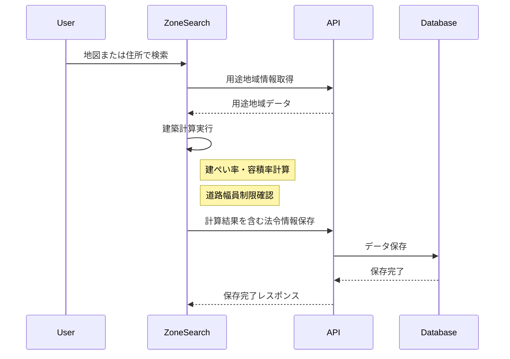

### 7.5 入力フォームの更新

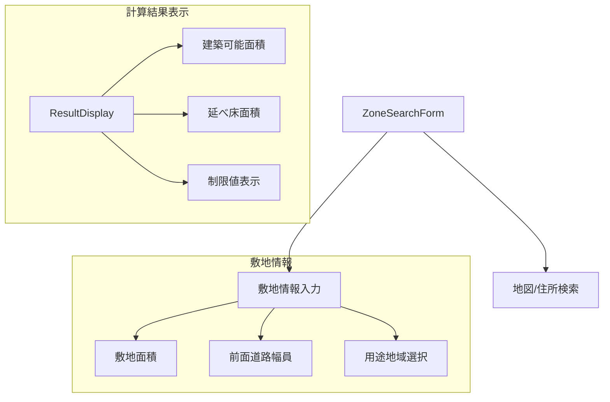
