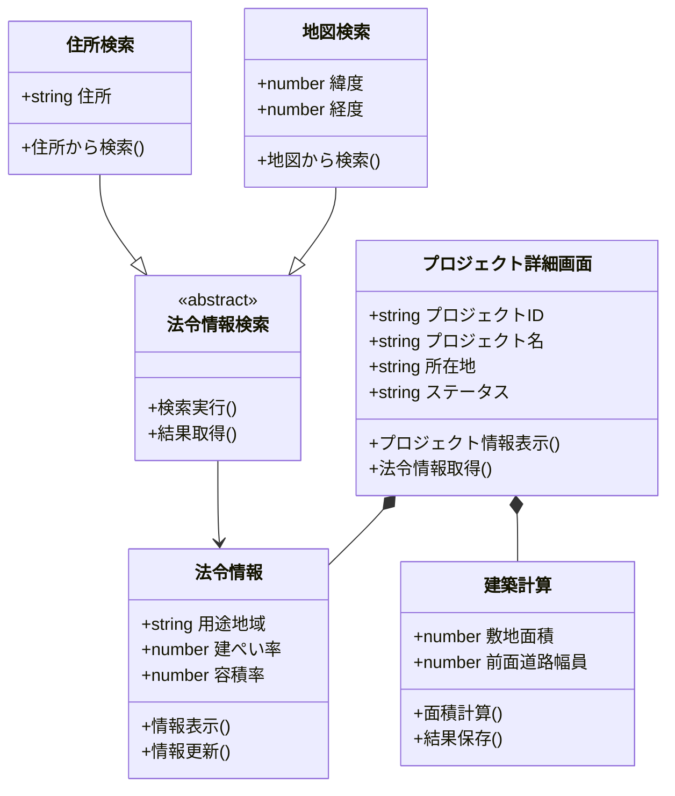
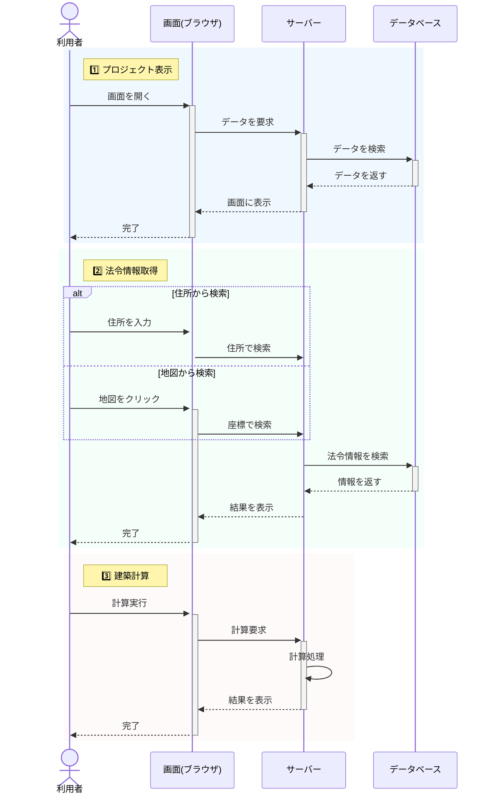

# プロジェクト管理システム - 設計図解説

## はじめに
このドキュメントでは、プロジェクト管理システムの基本的な構造と処理の流れを説明します。

## システムの全体像
このシステムは、建築プロジェクトの管理と法令チェックを支援するツールです。

### 主な機能
1. プロジェクト情報の管理
2. 法令情報の自動取得
3. 建築可能な面積の計算

## クラス図

プロジェクト管理システムのコンポーネント構成を表すクラス図です。

## シーケンス図

プロジェクトでの基本的な操作の流れを表しています。

## 処理の詳細説明

### 1. プロジェクト表示
- **目的**: プロジェクトの基本情報を確認します
- **手順**:
  1. ブラウザでプロジェクト画面を開く
  2. サーバーがデータベースから情報を取得
  3. 画面に情報を表示

### 2. 法令情報取得
- **目的**: 建築予定地の法令情報を取得します
- **取得方法**:
  - 住所から検索: 住所を入力して検索
  - 地図から検索: 地図上をクリックして検索
- **取得情報**:
  - 用途地域
  - 建ぺい率・容積率
  - その他の建築規制

### 3. 建築計算
- **目的**: 建築可能な面積を計算します
- **入力項目**:
  - 敷地面積
  - 前面道路幅員
- **計算結果**:
  - 建築可能面積
  - 延べ床面積

## 使用技術とコンポーネント
1. **フロントエンド**
   - React.js: ユーザーインターフェース
   - TailwindCSS: スタイリング

2. **バックエンド**
   - Node.js: サーバーサイド処理
   - PostgreSQL: データベース

3. **外部サービス**
   - 地図API: 位置情報の取得
   - 法令情報API: 建築規制の取得

## 開発の流れ
1. プロジェクト作成
2. 法令情報の検索
3. 計算実行
4. 結果の保存

## 次のステップ
- プロジェクトの新規作成方法
- 詳細な法令チェックの方法
- 計算結果のエクスポート
