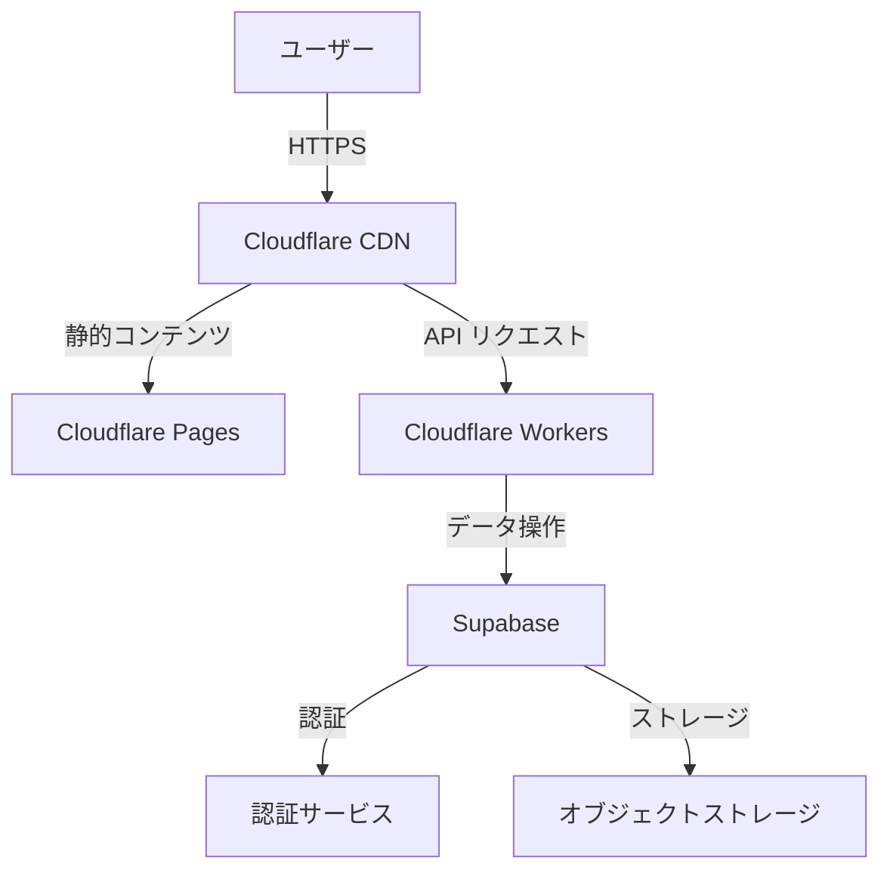

# インフラストラクチャ設定

このディレクトリには、Legal APIプロジェクトのインフラストラクチャ設定に関するドキュメントが含まれています。

## ファイル構成

- `cloudflare-setup.md` - Cloudflare設定手順
- `deployment.md` - デプロイ手順
- `security.md` - セキュリティ設定
- `monitoring.md` - モニタリング設定

## インフラストラクチャ概要

### 使用サービス

1. **Cloudflare**
   - Pages: フロントエンドホスティング
   - Workers: バックエンドAPI
   - DNS: ドメイン管理
   - WAF: セキュリティ

2. **Supabase**
   - データベース
   - 認証
   - ストレージ

### アーキテクチャ図

## 環境構成

### 本番環境

- ドメイン: `api.legal-service.com`
- SSL/TLS: Full (Strict)
- CDN: Cloudflare Enterprise
- データベース: Supabase Pro

### ステージング環境

- ドメイン: `staging.legal-service.com`
- SSL/TLS: Full
- CDN: Cloudflare Pro
- データベース: Supabase Team

### 開発環境

- ドメイン: `dev.legal-service.com`
- SSL/TLS: Full
- CDN: Cloudflare Free
- データベース: Supabase Free

## セキュリティ設定

### WAF設定

- OWASP Top 10対策
- レートリミット
- IPレピュテーション
- カスタムルール

### アクセス制御

- Bearer認証
- JWTトークン
- CORS設定

## モニタリング

### メトリクス

- レスポンスタイム
- エラーレート
- リクエスト数
- キャッシュヒット率

### アラート設定

| メトリクス | 閾値 | アクション |
|------------|------|------------|
| エラーレート | > 1% | Slack通知 |
| レスポンスタイム | > 1秒 | メール通知 |
| CPU使用率 | > 80% | 自動スケール |

## バックアップ

### データベース

- 自動バックアップ: 毎日
- 保持期間: 30日
- リストア手順: [リンク]

### コード

- GitHub Actions
- タグ付けルール
- バージョン管理

## 障害対応

### エスカレーションフロー

1. 自動検知
2. 担当者通知
3. 初期対応
4. 状況報告
5. 本格対応

### 復旧手順

1. 障害切り分け
2. 影響範囲特定
3. 対応策実施
4. 検証
5. 報告

## 参考リンク

- [Cloudflareドキュメント](https://developers.cloudflare.com/)
- [Supabaseドキュメント](https://supabase.com/docs)
- [セキュリティガイドライン](./security.md)
- [モニタリングガイド](./monitoring.md) 