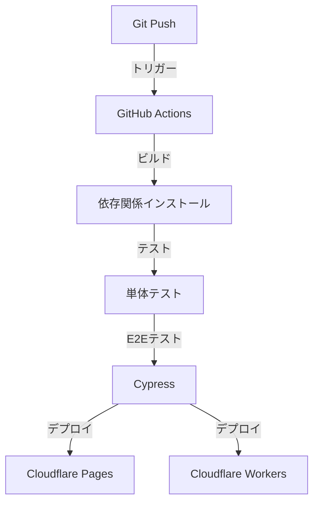

# Legal APIプロジェクトのデプロイ手順

このドキュメントでは、Legal APIプロジェクトのフロントエンドとバックエンドのデプロイ手順について説明します。

## 目次

1. [前提条件](#前提条件)
2. [フロントエンドのデプロイ](#フロントエンドのデプロイ)
3. [バックエンドのデプロイ](#バックエンドのデプロイ)
4. [環境変数の設定](#環境変数の設定)
5. [動作確認](#動作確認)
6. [トラブルシューティング](#トラブルシューティング)

## 前提条件

- Node.js 18.x以上
- GitHubアカウント
- Cloudflareアカウント
- Supabaseプロジェクト

必要なツールのインストール：

```bash
# Cloudflare Wranglerのインストール
npm install -g wrangler

# Cloudflareへのログイン
wrangler login
```

## フロントエンドのデプロイ

### 1. ビルドの準備

```bash
cd frontend
npm install
npm run build
```

### 2. Cloudflare Pagesの設定

1. Cloudflareダッシュボードにアクセス
2. "Workers & Pages" > "Create application" > "Pages" > "Connect to Git"を選択
3. GitHubリポジトリを選択
4. 以下のビルド設定を構成：

```yaml
Build settings:
  Framework preset: Vite
  Build command: npm run build
  Build output directory: dist
  Root directory: frontend
  Node.js version: 18.x
```

### 3. 環境変数の設定

Cloudflare Pagesダッシュボードで以下の環境変数を設定：

```env
VITE_SUPABASE_URL=your_supabase_url
VITE_SUPABASE_ANON_KEY=your_supabase_anon_key
VITE_API_URL=https://legal-api-backend.your-worker-subdomain.workers.dev
```

## バックエンドのデプロイ

### 1. Workerの準備

```bash
cd backend
npm install
```

### 2. 環境変数の設定

```bash
# Supabase URLの設定
wrangler secret put SUPABASE_URL
# プロンプトが表示されたら、Supabase URLを入力

# Supabase Anon Keyの設定
wrangler secret put SUPABASE_ANON_KEY
# プロンプトが表示されたら、Supabase Anon Keyを入力
```

### 3. Workerのデプロイ

```bash
npm run deploy
```

デプロイ後、以下のURLでアクセス可能になります：
`https://legal-api-backend.{your-worker-subdomain}.workers.dev`

## 環境変数の設定

### フロントエンド（Cloudflare Pages）

| 変数名 | 説明 | 例 |
|--------|------|-----|
| VITE_SUPABASE_URL | SupabaseのURL | https://xxx.supabase.co |
| VITE_SUPABASE_ANON_KEY | Supabaseの匿名キー | eyJ... |
| VITE_API_URL | バックエンドのAPI URL | https://legal-api-backend.workers.dev |

### バックエンド（Cloudflare Workers）

| 変数名 | 説明 | 設定方法 |
|--------|------|----------|
| SUPABASE_URL | SupabaseのURL | wrangler secret put SUPABASE_URL |
| SUPABASE_ANON_KEY | Supabaseの匿名キー | wrangler secret put SUPABASE_ANON_KEY |

## 動作確認

### 1. フロントエンドの確認

1. ブラウザで`https://{your-project}.pages.dev`にアクセス
2. 以下の機能を確認：
   - ページの表示
   - APIとの通信
   - Supabaseとの接続

### 2. バックエンドの確認

APIエンドポイントの動作確認：

```bash
# プロジェクト一覧の取得
curl https://legal-api-backend.{your-worker-subdomain}.workers.dev/api/projects
```

## トラブルシューティング

### CORSエラー

フロントエンドからバックエンドへのリクエストでCORSエラーが発生する場合：

1. `worker.js`のCORS設定を確認
2. Cloudflare Pagesの環境変数でAPIのURLが正しく設定されているか確認

### ビルドエラー

フロントエンドのビルドが失敗する場合：

1. Node.jsバージョンが18.x以上であることを確認
2. 必要な環境変数がすべて設定されているか確認
3. `npm install`を再実行

### APIエラー

バックエンドのAPIがエラーを返す場合：

1. Supabase接続情報が正しく設定されているか確認
2. Workersの環境変数が正しく設定されているか確認
3. Workersのログで詳細なエラー情報を確認

## 参考リンク

- [Cloudflare Pages Documentation](https://developers.cloudflare.com/pages)
- [Cloudflare Workers Documentation](https://developers.cloudflare.com/workers)
- [Vite Documentation](https://vitejs.dev/guide/)

## デプロイメントパイプライン

### 1. 自動デプロイフロー



### 2. 環境別デプロイ設定

```yaml
# 開発環境
Development:
  Branch: dev
  Domain: dev.legal-service.com
  Auto Deploy: true
  Build Command: npm run build:dev

# ステージング環境
Staging:
  Branch: staging
  Domain: staging.legal-service.com
  Auto Deploy: true
  Build Command: npm run build:staging

# 本番環境
Production:
  Branch: main
  Domain: legal-service.com
  Auto Deploy: false
  Approval Required: true
  Build Command: npm run build:prod
```

## ロールバック手順

### 1. フロントエンド（Cloudflare Pages）

```bash
# 特定バージョンへのロールバック
wrangler pages deployment rollback <deployment-id>

# 直前のデプロイメントへのロールバック
wrangler pages deployment rollback --to-last
```

### 2. バックエンド（Cloudflare Workers）

```bash
# 特定バージョンの確認
wrangler worker list-versions

# ロールバック実行
wrangler rollback <version>
```

## デプロイ後の検証

### 1. 自動化テスト

```bash
# E2Eテスト実行
npm run test:e2e

# API健全性チェック
npm run test:api

# パフォーマンステスト
npm run test:performance
```

### 2. 手動検証項目

- [ ] ログイン/認証機能
- [ ] API接続
- [ ] フォーム送信
- [ ] ファイルアップロード
- [ ] PDFダウンロード
- [ ] 検索機能

## 監視設定

### 1. アプリケーションログ

```javascript
// ログレベル設定
const LOG_LEVELS = {
  ERROR: 'error',
  WARN: 'warn',
  INFO: 'info',
  DEBUG: 'debug'
};

// ログ出力設定
const logger = {
  error: (message, context) => {
    console.error(JSON.stringify({
      level: LOG_LEVELS.ERROR,
      message,
      context,
      timestamp: new Date().toISOString()
    }));
  }
  // 他のログレベルも同様に実装
};
```

### 2. メトリクス収集

```yaml
# Cloudflareメトリクス設定
Metrics:
  - Request Count
  - Error Rate
  - Response Time
  - Cache Hit Rate
  - CPU Usage
  - Memory Usage

Alerts:
  - Error Rate > 1%
  - Response Time > 1s
  - CPU Usage > 80%
```

## 緊急時対応

### 1. デプロイ失敗時

1. ログの確認
```bash
wrangler pages deployment tail
```

2. 即時ロールバック
```bash
wrangler pages deployment rollback --to-last
```

3. 障害報告
```bash
# Slackへの通知
curl -X POST -H 'Content-type: application/json' \
--data '{"text":"Deploy Failed: {details}"}' \
$SLACK_WEBHOOK_URL
```

### 2. パフォーマンス問題

1. キャッシュの確認と更新
```bash
# キャッシュ状態の確認
wrangler pages deployment inspect

# キャッシュのパージ
wrangler pages deployment purge
```

2. スケーリング設定
```yaml
# Workers設定
workers_dev: true
usage_model: bundled
compatibility_date: "2024-02-21"

[triggers]
crons = ["*/5 * * * *"]  # 5分ごとのヘルスチェック
```

## セキュリティ対策

### 1. 環境変数の管理

```bash
# 環境変数の暗号化
wrangler secret encrypt SUPABASE_URL
wrangler secret encrypt SUPABASE_ANON_KEY

# 環境変数のローテーション
wrangler secret rotate --name SUPABASE_ANON_KEY
```

### 2. アクセス制御

```yaml
# IPアクセス制限
IP_RULES:
  - Allow: ["123.456.789.0/24"]  # オフィスIP
  - Deny: ["*"]  # その他すべて

# 認証設定
AUTH_RULES:
  - Path: "/api/admin/*"
    Auth: "Bearer"
  - Path: "/api/public/*"
    Auth: "None"
``` 