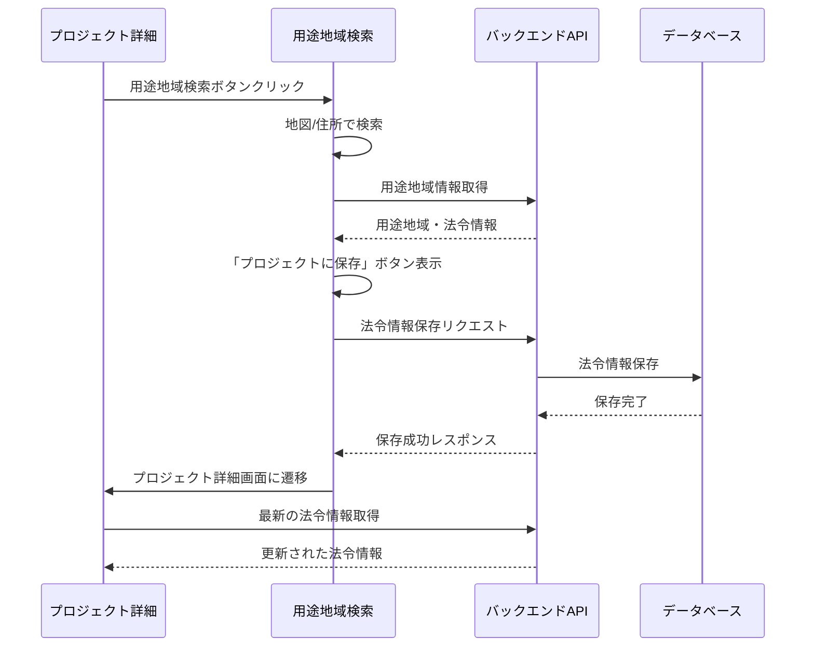
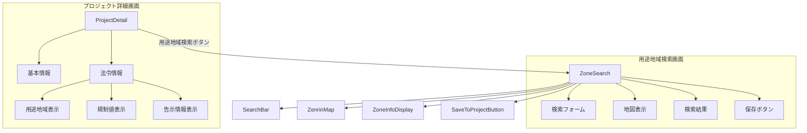
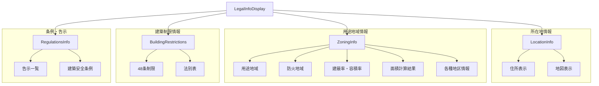

# Legal API プロジェクト状況

## 1. プロジェクト概要
法令情報管理システムの開発プロジェクト。Zenrin Maps APIを活用した地図ベースの法令情報検索と、プロジェクト管理機能を統合したシステム。

## 2. システム構成
### フロントエンド（React）
- `frontend/`
  - `src/features/` - 機能モジュール
  - `src/components/` - 共通コンポーネント
  - `src/services/` - APIサービス
  - `src/pages/` - ページコンポーネント
  - `src/hooks/` - カスタムフック
  - `src/utils/` - ユーティリティ関数

### バックエンド（Express）
- `backend/`
  - `src/` - ソースコード
  - `tests/` - テストコード
  - `e2e/` - E2Eテスト
  - `config/` - 設定ファイル

## 3. 実装状況

### 3.1 実装済み機能 
1. **地図表示基本機能**
   - Zenrin Maps APIによる地図表示
   - 地点選択機能
   - 用途地域情報の表示
   - 住所検索機能
   - 法令情報の自動取得
   - 地図表示の最適化（キャッシュ機能）
   - エラーハンドリングとリトライ機能
   - ヘルプ機能

2. **プロジェクト管理基本機能**
   - プロジェクトCRUD操作
   - プロジェクト一覧表示
   - プロジェクト詳細表示
   - 基本情報の編集

3. **法令情報表示機能**
   - 所在地情報表示
   - 用途地域情報表示と編集
   - 建築制限情報表示
   - 条例・告示情報表示
   - 建築計算機能
     - 建築可能面積の自動計算
     - 延べ床面積の自動計算
     - 道路幅員制限の自動計算
   - バリデーション機能
     - 入力値の検証
     - 数値変換の検証
     - 必須パラメータの検証

4. **コードベースの整理**
   - 定数の分離（zoneTypes.js）
   - バリデーションロジックの分離（validators.js）
   - 計算ロジックの分離（calculators.js）
   - コンポーネントの責務分離
   - エラーハンドリングの統一

### 3.2 開発中の機能 
1. **法令情報編集機能の拡充**
   - 一括保存機能の実装
   - 編集履歴の管理
   - 変更の自動保存

2. **地図連携機能の強化**
   - リアルタイムデータ更新
   - 地図上での編集機能
   - 複数地点の一括処理

3. **テスト整備**
   - ユニットテストの追加
   - 統合テストの実装
   - E2Eテストの準備

### 3.3 今後の実装予定 
1. **法令チェックリスト機能の拡充**
   - プロジェクト情報に基づく自動生成
   - 進捗管理機能
   - レポート機能

2. **テスト拡充**
   - 統合テストの追加
   - E2Eテストシナリオの拡充
   - パフォーマンステスト

## 4. データベース設計

```sql
-- プロジェクト管理
CREATE TABLE projects (
    id SERIAL PRIMARY KEY,
    name VARCHAR(255) NOT NULL,
    location TEXT,
    scale VARCHAR(100),
    usage_type VARCHAR(100),
    status VARCHAR(50),
    created_at TIMESTAMP DEFAULT CURRENT_TIMESTAMP,
    updated_at TIMESTAMP DEFAULT CURRENT_TIMESTAMP
);

-- 法令文書
CREATE TABLE legal_documents (
    id SERIAL PRIMARY KEY,
    project_id INTEGER REFERENCES projects(id),
    location TEXT NOT NULL,
    latitude FLOAT NOT NULL,
    longitude FLOAT NOT NULL,
    created_at TIMESTAMP DEFAULT CURRENT_TIMESTAMP,
    updated_at TIMESTAMP DEFAULT CURRENT_TIMESTAMP
);

-- 用途地域情報
CREATE TABLE zone_info (
    id SERIAL PRIMARY KEY,
    legal_document_id INTEGER REFERENCES legal_documents(id),
    zone_type VARCHAR(100) NOT NULL,
    regulations JSONB NOT NULL,
    coverage_ratio FLOAT,
    floor_area_ratio FLOAT,
    height_restrictions JSONB,
    created_at TIMESTAMP DEFAULT CURRENT_TIMESTAMP
);

-- 告示情報
CREATE TABLE kokuji_info (
    id SERIAL PRIMARY KEY,
    legal_document_id INTEGER REFERENCES legal_documents(id),
    kokuji_id VARCHAR(100) NOT NULL,
    kokuji_text TEXT NOT NULL,
    effective_date DATE,
    created_at TIMESTAMP DEFAULT CURRENT_TIMESTAMP
);

-- 法令更新情報
CREATE TABLE legal_updates (
    id SERIAL PRIMARY KEY,
    title VARCHAR(255) NOT NULL,
    content TEXT,
    law_type VARCHAR(100),
    update_date TIMESTAMP,
    effective_date TIMESTAMP,
    created_at TIMESTAMP DEFAULT CURRENT_TIMESTAMP
);

-- 用途地域情報
CREATE TABLE zoning_info (
    id SERIAL PRIMARY KEY,
    project_id INTEGER REFERENCES projects(id),
    zone_type VARCHAR(100),
    coordinates JSONB,
    created_at TIMESTAMP DEFAULT CURRENT_TIMESTAMP
);

-- チェックリスト
CREATE TABLE checklists (
    id SERIAL PRIMARY KEY,
    project_id INTEGER REFERENCES projects(id),
    title VARCHAR(255) NOT NULL,
    description TEXT,
    due_date TIMESTAMP,
    status VARCHAR(50),
    created_at TIMESTAMP DEFAULT CURRENT_TIMESTAMP
);

-- チェックリスト項目
CREATE TABLE checklist_items (
    id SERIAL PRIMARY KEY,
    checklist_id INTEGER REFERENCES checklists(id),
    content TEXT NOT NULL,
    status VARCHAR(50),
    due_date TIMESTAMP,
    created_at TIMESTAMP DEFAULT CURRENT_TIMESTAMP
);
```

## 5. API設計

```markdown
# API Endpoints

## プロジェクト管理 API
GET    /api/v1/projects           # プロジェクト一覧取得
POST   /api/v1/projects           # プロジェクト作成
GET    /api/v1/projects/:id       # プロジェクト詳細取得
PUT    /api/v1/projects/:id       # プロジェクト更新
DELETE /api/v1/projects/:id       # プロジェクト削除

## 法令情報 API
POST   /api/v1/projects/:id/legal-docs     # 法令情報保存
GET    /api/v1/projects/:id/legal-docs     # プロジェクトの法令情報一覧取得
GET    /api/v1/legal-docs/:id              # 法令情報詳細取得
PUT    /api/v1/legal-docs/:id              # 法令情報更新
DELETE /api/v1/legal-docs/:id              # 法令情報削除
PATCH  /api/v1/legal-docs/:id/regulations  # 規制情報の部分更新
PATCH  /api/v1/legal-docs/:id/kokuji       # 告示情報の部分更新

## 用途地域 API
GET    /api/v1/zoning/search      # 用途地域検索
GET    /api/v1/zoning/:id/details # 用途地域詳細取得

## 法令アップデート API
GET    /api/v1/legal-updates              # 法令更新情報一覧取得
GET    /api/v1/legal-updates/:id          # 法令更新詳細取得
GET    /api/v1/legal-updates/unread       # 未読の法令更新取得
PUT    /api/v1/legal-updates/:id/read     # 既読マーク付与

## チェックリスト API
GET    /api/v1/projects/:id/checklists    # プロジェクトのチェックリスト取得
POST   /api/v1/projects/:id/checklists    # チェックリスト作成
PUT    /api/v1/checklists/:id             # チェックリスト更新
GET    /api/v1/checklists/:id/items       # チェックリスト項目取得
POST   /api/v1/checklists/:id/items       # チェックリスト項目追加
PUT    /api/v1/checklist-items/:id        # チェックリスト項目更新
```

## 6. 今後の開発計画

### 6.1 短期目標（1-2週間）
1. プロジェクト管理機能の完成
   - プロジェクト詳細画面の実装
     - 法令情報一覧コンポーネントの作成
     - 編集フォームの実装
     - 地図連携機能の統合
   - 検索・フィルタリング機能の実装

2. テストカバレッジの向上
   - コンポーネントテストの追加
   - API統合テストの実装

### 6.2 中期目標（1-2ヶ月）
1. 法令アップデート通知機能の実装
   - 法令データベース連携の完成
   - 通知システムの実装
   - ユーザー設定機能の追加

2. チェックリスト機能の拡充
   - 自動生成機能の実装
   - 進捗管理機能の実装
   - レポート機能の実装

### 6.3 長期目標（3-6ヶ月）
1. システム全体の最適化
   - パフォーマンス改善
   - UI/UXの改善
   - セキュリティ強化

2. 追加機能の実装
   - ユーザー管理・認証システム
   - データ分析・レポート機能
   - API機能の拡充 

## 7. URL構造

### 7.1 メインページ
- `/` - ホームページ
- `/dashboard` - ダッシュボード

### 7.2 プロジェクト関連
- `/projects` - プロジェクト一覧
- `/projects/new` - 新規プロジェクト作成
- `/projects/:id` - プロジェクト詳細
  - 基本情報表示
  - 法令情報表示セクション
    - 所在地情報
    - 用途地域情報
      - 用途地域
      - 防火地域
      - 建蔽率・容積率
      - 建築面積・延べ床面積（自動計算）
      - 高度地区
      - 区域区分
      - 風致地区
    - 建築制限情報
      - 建築基準法48条関連
      - 法別表第２
    - 条例・告示情報
      - 告示文
      - 東京都建築安全条例
  - 右上に用途地域検索ボタン配置
- `/projects/:id/edit` - プロジェクト編集
- `/projects/:id/checklist` - プロジェクトのチェックリスト

### 7.3 法令情報関連
- `/legal/zone-search` - 用途地域検索
  - 地図または住所で検索
  - 検索結果表示
    - 所在地情報
    - 用途地域情報
      - 用途地域
      - 防火地域
      - 建蔽率・容積率
      - 建築面積・延べ床面積（自動計算）
      - 高度地区
      - 区域区分
      - 風致地区
    - 建築制限情報
      - 建築基準法48条関連
      - 法別表第２
    - 条例・告示情報
      - 告示文
      - 東京都建築安全条例
  - 右上に「プロジェクトに保存」ボタン
    - クリックで確認ダイアログ表示
    - 保存成功後、プロジェクト詳細画面（`/projects/:id`）に自動遷移
- `/legal/updates` - 法令アップデート一覧
- `/legal/updates/:id` - 法令アップデート詳細

### 7.4 チェックリスト関連
- `/checklists` - チェックリスト一覧
- `/checklists/:id` - チェックリスト詳細
- `/checklists/:id/edit` - チェックリスト編集

### 7.5 設定・その他
- `/settings` - 設定画面
- `/notifications` - 通知一覧
- `/help` - ヘルプページ 

## 8. 画面遷移フロー

### 8.1 法令情報保存フロー


### 8.2 コンポーネント構成


## 9. データ構造

### 9.1 法令情報のデータ構造
```json
{
  "location": {
    "address": "東京都千代田区丸の内1-1-1",
    "coordinates": {
      "latitude": 35.681236,
      "longitude": 139.767125
    }
  },
  "zoning_info": {
    "zone_type": "商業地域",
    "fire_prevention": "防火地域",
    "coverage_ratio": 80,
    "floor_area_ratio": 400,
    "building_area": 800,
    "total_floor_area": 3200,
    "height_district": "第三種高度地区",
    "area_classification": "市街化区域",
    "scenic_district": null
  },
  "building_restrictions": {
    "building_standard_law_48": {
      "allowed_uses": ["事務所", "店舗", "共同住宅"],
      "restrictions": []
    },
    "law_appendix_2": {
      "category": "第二種",
      "restrictions": []
    }
  },
  "regulations": {
    "notifications": [{
      "notification_id": "412K500040001453",
      "content": "...",
      "effective_date": "2024-01-01"
    }],
    "tokyo_building_safety": {
      "article_numbers": ["第30条", "第31条"],
      "content": "..."
    }
  }
}
```

### 9.2 表示コンポーネント構成


## 進行中の機能実装

### 法令情報管理機能

**状態**: 実装中
**優先度**: 高
**担当**: 未割り当て

#### 概要
プロジェクトごとの法令情報（用途地域、建蔽率、容積率など）と告示文を管理する機能を実装します。

#### 実装項目

1. バックエンド
   - [x] API仕様の策定
   - [ ] データベーススキーマの設計
     - [ ] 法令情報テーブル
     - [ ] 告示文テーブル
     - [ ] プロジェクト関連テーブル
   - [ ] モデルの実装
     - [ ] LegalInfo モデル
     - [ ] Kokuji モデル
   - [ ] APIエンドポイントの実装
     - [ ] 法令情報API
     - [ ] 告示文API
   - [ ] バリデーションの実装
   - [ ] テストの実装

2. フロントエンド
   - [x] 用途地域検索画面の実装
   - [x] 法令情報表示コンポーネントの実装
   - [x] 告示文表示ダイアログの実装
   - [ ] APIクライアントの実装
     - [ ] 法令情報API
     - [ ] 告示文API
   - [ ] プロジェクト詳細画面との連携
   - [ ] テストの実装

#### 告示文機能の詳細

1. データベース
   ```sql
   -- 告示文テーブル
   CREATE TABLE kokuji (
       id SERIAL PRIMARY KEY,
       kokuji_id VARCHAR(100) NOT NULL UNIQUE,
       title TEXT NOT NULL,
       kokuji_text TEXT NOT NULL,
       effective_date DATE,
       category VARCHAR(100),
       created_at TIMESTAMP DEFAULT CURRENT_TIMESTAMP
   );

   -- プロジェクトと告示文の関連テーブル
   CREATE TABLE project_kokuji (
       id SERIAL PRIMARY KEY,
       project_id INTEGER REFERENCES projects(id),
       kokuji_id VARCHAR(100) REFERENCES kokuji(kokuji_id),
       memo TEXT,
       created_at TIMESTAMP DEFAULT CURRENT_TIMESTAMP,
       UNIQUE(project_id, kokuji_id)
   );
   ```

2. API実装
   - GET /api/v1/kokuji/:kokujiId
   - GET /api/v1/projects/:id/kokuji
   - POST /api/v1/projects/:id/kokuji

3. フロントエンド実装
   - 告示文表示ダイアログ
   - 告示文一覧表示
   - プロジェクトへの関連付け機能

#### 技術スタック
- バックエンド: Express.js, Supabase
- フロントエンド: React, TypeScript
- テスト: Jest, React Testing Library

#### タイムライン
- API仕様策定: 完了
- バックエンド実装: 未着手
- フロントエンド実装: 進行中
- テスト実装: 未着手
- デプロイ: 未着手

#### 次のステップ
1. データベーススキーマの設計と実装
2. バックエンドAPIの実装
3. フロントエンドとの連携テスト
4. E2Eテストの実装

## その他の機能

[既存の内容をここに保持]
